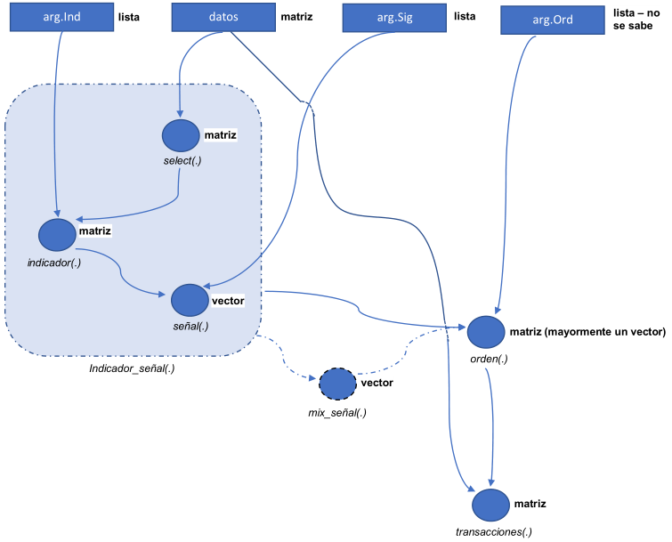

<!-- # bookdown::html_document2: -->

<!-- # bookdown::pdf_document2: -->

<!-- <p style="font-size:34px;line-height: 1.1;">Implementación de indicadores</p> -->

# Implementación de indicadores 

[](https://www.tidyverse.org/lifecycle/#stable)


<!---
[](https://travis-ci.org/tidyverse/purrr)
[](https://ci.appveyor.com/project/tidyverse/purrr)
[](https://codecov.io/github/tidyverse/purrr?branch=master)
-->

## Sinopsis

Es una breve descripción del flujo de las funciones para realizar
backtesting a partir de una estrategia y el uso de este para la
implementación de distintas estrategias de trading. Aún se esta
mejorando el uso de este.

## Estrategia

Se considera una estrategia como una combinación de indicadores y reglas
para generar señales para entrar y salir de transacciones. La idea
detrás de esto se presenta en la siguiente gráfica:

<div style="text-align: center">



</div>

Esto permite realizar distintas modificaciones a la estrategia:

  - Si se desea realizar una estrategia con mas de una combinación
    indicador-señal. Se puede generar varias señales (con la función
    *Indicador\_señal(.)*) y luego con alguna función ( *mix\_señal(.)*)
    combinarlas para convertirla en una señal.

  - A partir de la señal generada se utiliza la función *orden(.)* la
    cual puede variar. Por ejemplo: puede ser ordenes normales, ordenes
    con stop loss, ordenes con stop loss movil, dependiendo de la que
    quede mejor con la estrategia. (Nota: no todas les funciona el mismo
    sistema de ordenes, por ejemplo, bandas de bollinger no funciona muy
    bien con un stop loss movil ya que es un indicador para identificar
    señales en rango (choppy market) es mejor un stop loss fijo,
    funcionando como una especie de support)

  - Y por ultimo, la salida de la función *orden(.)* se pasa por
    transacciones, la cuál computa el backtesting de la estrategia.

Algo importante para notar en este caso es que las tres funciones
principales *Indicador\_señal(.)*, *orden(.)* y *transacciones(.)*
necesitan de los datos, esto permite poder utilizar en cada paso
información diferente de los datos, es claro que en el calculo de un
indicador se utiliza diferente información, al igual que la función de
*orden(.)* que por construcción puede utilizar cualquier información de
los datos, por ejemplo el stop loss movil utiliza el promedio movil
ponderado de los close para ir moviendo el valor del stop movil en vez
de tomar la serie del close ya que esta esta es mas volátil.

## Tabla de especificaciones `tbl.specs`

En esta tabla se encuentra las especificaciones esenciales para poder
programar la estrategia. En ella se encuentra lo siguiente:

  - **nameInd** := Nombre corto y único para llamar la estrategia.
  - **f** := Nombre de la función que calcula los indicadores.
  - **dat.f** := Nombre de la función que selecciona los datos, los
    cuales entrar como argumento principal a la función **f**.
  - **sig.f** := Nombre de la función que calcula las señales a partir
    de la salida de **f**.
  - **parms** := Parámetros para el calculo del indicador, en forma de
    lista.
  - **sig.parms** := Parámetros para el calculo de la señal, en forma de
    lista.

<!-- end list -->

``` r
tbl.specs <- tribble(
  ~nameInd, ~f, ~dat.f, ~sig.f, ~parms, ~sig.parms,
  'adx', 'ADX', 'hlc', 'sig.ADXL', list(), list(limit = 25),
  'smaTwo', 'SMAtwo', 'cl', 'sig.SMAtwo', list(nfast = 30, nslow = 100), list(),
  'bands', 'BBands', 'hlc', 'sig.BBands', list(), list()
)

tbl.specs
```

    ## # A tibble: 3 x 6
    ##   nameInd f      dat.f sig.f      parms      sig.parms 
    ##   <chr>   <chr>  <chr> <chr>      <list>     <list>    
    ## 1 adx     ADX    hlc   sig.ADXL   <list [0]> <list [1]>
    ## 2 smaTwo  SMAtwo cl    sig.SMAtwo <list [2]> <list [0]>
    ## 3 bands   BBands hlc   sig.BBands <list [0]> <list [0]>

Por el momento son muchas cosas para determinar, pero esto facilita la
forma de poder usarlas en la forma actual del código. Si en las columnas
**parms** y **sig.parms** se dejan listas vacías, el toma los parámetros
que tiene por defecto las funciones **f** y **sig.f** o pueden variar al
antojo (como para hacer tunning de la estrategia).

<div class="customBlock">

**NOTA:** Es importante que los nombres de las funciones en la tabla
`tbl.specs` estén cargadas antes de proseguir. La mayoría de funciones
para calcular indicadores salen del paquete `TTR`, por lo tanto es
necesario siempre tener cargado este paquete.

</div>

## `indSeg(.)` la función *Indicador\_señal*

Esta función genera un vector con las señales producto de un indicador.
Está se encuentra en “src/Funciones/FunEstrategia.R” y cuenta con los
siguiente parámetros.

``` r
args(indSeg)
```

    ## function (parm = NULL, sigParm = NULL, datos, indName) 
    ## NULL

Como se puede ver en los argumentos, es necesario darle la tabla de
`datos`, el nombre del indicador `indName` y opcionalmente se pueden las
listas de los parámetros `parm` y `sigParm`. La ventaja de esta función
es que nos permite realizar tunning de los parametros o poder combinar
varias señales en una.

### Funciones `f` y `sig.f`

Estas funciones deben estar cargadas, la mayoría de veces la función que
calcula el indicador `f` se encuentra en el paquete `TTR`. Pero se
pueden crear nuevos indicadores escribiendo su función en el script
“src/Funciones/Reglas.R”, al igual que la función `sig.f` y `dat.f`,
de la siguiente forma [ver
script](https://github.com/cuzaheta/Factors/blob/master/src/Funciones/Reglas.R):

``` r
# seleccionar datos -------------------------------------------------------
cl <- . %>% select(close)

# Nuevos indicadores ------------------------------------------------------
SMAtwo <- function(price, nfast = 15, nslow = 80){
  # Estrategía dos medias
  price <- pull(price)
  tibble(difMA = SMA(price, nfast) - SMA(price, nslow))
}

# Funciones señales -------------------------------------------------------
sig.SMAtwo <- function(X){
  # Salida de SMAtwo con columnas('difMA')
  -sigThresh(X[,'difMA'], 0, 0)
}
```

Estas funciones componen el indicador de la segunda fila de la tabla
`tbl.specs`.

<!-- 

VER COMBINAR VARIAS SEÑALES 

-->

## `orden(.)`

Se separo la función ordenes con el objetivo de poder cambiar la forma
de salir de la transacción la mayoría en base a stop loss o take profit.
Para implementar una nueva metodología para ordenes, se encuentran en
“src/Funciones/Ordenes.R” de la siguiente forma: [ver
script](https://github.com/cuzaheta/Factors/blob/master/src/Funciones/Ordenes.R)

``` r
OrdenesSLTP <- function(signal, datos, vloss, vfee = fee, vprofit = profit){
  isCont <- sum(!is.na(unique(signal))) == 2
  if(is.na(vloss)) vloss <- 0.999
  
  if(!isCont){# Discontinuas
    infOrdenISLTP <- vencomDisSLTP(signal, datos, vloss, vprofit, vfee)
  }else{# Continuas
    infOrdenISLTP <- vencomConSLTP(signal, datos, vloss, vprofit, vfee)
  }
  return(infOrdenISLTP)
}
```

En donde las funciones `vencomDisSLTP` y `vencomConSLTP`, depende si la
señal es discontinua o continua, determinado por la variable `isCont`.
Se necesitan crear las tres funciones tanto `vencomDisSLTP` y
`vencomConSLTP` como `OrdenesSLTP`, esta ultima con el fin de poderla
usar en el flujo de la estrategia.

Los principales argumentos de esta función siempre van a ser la señal
`signal` que es un vector y la tabla de datos, los argumento secundarios
van a variar dependiendo de lo que necesite las funciones de ordenes.

## `fun.tran` la función de *transacciones*

Y por ultimo, esta la función que a partir de las ordenes calcula el
backtesting. Está función se encuentra en
“src/Funciones/FunEstrategia.R” y tiene los siguiente parámetros.

``` r
args(fun.tran)
```

    ## function (ordenes, datos) 
    ## NULL

Necesita la salida de la función ordenes pudiendo ser un vector o un
tibble (data\_frame) que contenga una columna llamada “orden” con las
ordenes en ella. Esto es porque en algunos casos la función ordenes
puede sacar mas de un vector resultado de ella, como lo son los tipos de
ordenes de salida de la transacción. Y también necesita la tabla de
datos.

# Ejemplos

## Correr una estrategia

En caso que estemos programando una nueva estrategia, se puede construir
desde cero. Con esto hago referencia tanto la función que genera los
nuevos indicadores (siendo acompañada de una función de señales) y una
nueva forma de generar las ordenes. El siguiente ejemplo combina dos
promedios móviles con un stop loss móvil.

``` r
datos30M_bch <- tbl.datos$data[[5]] %>% 
  mutate(ma = EMA(close, 5),
         maRet =  ROC(ma, 1))

twoSmaSig <- indSeg(list(nfast = 35, nslow = 63), NULL,
                    datos = datos30M_bch, indName = 'smaTwo')

ordenSLM <- OrdenesSLMovil(twoSmaSig, datos30M_bch, 0.03)

tbl_trans <- fun.tran(ordenSLM, datos30M_bch)

tbl_trans
```

    ## # A tibble: 132 x 5
    ##    tran.num  retorno date.entrada        date.salida         cum.retorno
    ##       <dbl>    <dbl> <dttm>              <dttm>                    <dbl>
    ##  1        1 -0.0388  2018-01-06 17:00:00 2018-01-06 21:30:00        96.1
    ##  2        2  0.0649  2018-01-08 18:30:00 2018-01-10 09:30:00       102. 
    ##  3        3 -0.00485 2018-01-12 08:00:00 2018-01-12 11:00:00       102. 
    ##  4        4 -0.0269  2018-01-12 21:00:00 2018-01-13 04:30:00        99.1
    ##  5        5 -0.0167  2018-01-13 13:30:00 2018-01-13 15:30:00        97.5
    ##  6        6 -0.0197  2018-01-13 19:30:00 2018-01-14 17:00:00        95.5
    ##  7        7 -0.0322  2018-01-18 11:00:00 2018-01-18 23:00:00        92.5
    ##  8        8 -0.0272  2018-01-21 00:00:00 2018-01-21 03:00:00        90.0
    ##  9        9 -0.0105  2018-01-22 07:00:00 2018-01-22 11:30:00        89.0
    ## 10       10 -0.0209  2018-01-25 17:00:00 2018-01-26 06:30:00        87.2
    ## # … with 122 more rows

``` r
plotTest(tbl_trans)
```

<!-- -->

La funcionalidad de separar las funciones en este caso es poder en dado
caso buscar una forma de encontrar los parámetros óptimos del indicador
y el porcentaje de loss. Como se puede ver en la gráfica este indicador
identifica transacciones de compra con alto profit, con el posible fin
de mejora este se puede combinar con algún otro indicador para descartar
malas entradas.

## Combinar indicadores

Vamos a combinar dos indicadores el de dos promedios móviles y el ADX,
este ultimo nos permite saber la fuerza de la tendencia y quizás sea una
buena forma de descartar una gran cantidad de entradas erróneas del
indicador base. Esto se puede llevar de la siguiente forma:

``` r
twoSmaSig <- indSeg(list(nfast = 20, nslow = 80), NULL,
                    datos = datos30M_bch, indName = 'smaTwo')
adxSig <- indSeg(list(n=16), list(limit= 30),
                 datos = datos30M_bch, indName = 'adx')

sigmix <- mix.ordenConfirm(twoSmaSig, adxSig)

# orden <- Ordenes(sigmix)

ordenSLM <- OrdenesSLMovil(sigmix, datos30M_bch, 0.028)

tbl_trans <- fun.tran(ordenSLM, datos30M_bch)

tbl_trans
```

    ## # A tibble: 42 x 5
    ##    tran.num  retorno date.entrada        date.salida         cum.retorno
    ##       <dbl>    <dbl> <dttm>              <dttm>                    <dbl>
    ##  1        1 -0.0255  2018-01-07 10:00:00 2018-01-07 14:00:00        97.5
    ##  2        2 -0.0251  2018-01-13 17:00:00 2018-01-14 21:00:00        95.0
    ##  3        3 -0.00287 2018-01-26 03:30:00 2018-01-26 04:00:00        94.7
    ##  4        4 -0.00289 2018-01-28 13:30:00 2018-01-30 00:00:00        94.5
    ##  5        5  0.0829  2018-02-08 11:30:00 2018-02-08 23:00:00       102. 
    ##  6        6 -0.0321  2018-03-01 10:00:00 2018-03-02 00:00:00        99.0
    ##  7        7  0.00579 2018-03-10 01:30:00 2018-03-12 09:30:00        99.6
    ##  8        8 -0.0262  2018-03-14 20:30:00 2018-03-15 02:00:00        97.0
    ##  9        9 -0.0316  2018-03-16 16:30:00 2018-03-16 21:30:00        93.9
    ## 10       10 -0.0130  2018-03-20 01:00:00 2018-03-21 07:30:00        92.7
    ## # … with 32 more rows

``` r
plotTest(tbl_trans)
```

<!-- -->

Como se puede ver en este ejemplo tan solo se repite el uso de la
función `indSeg(.)` y se incluye una nueva función
`mix.ordenConfirm(.)` la cuál combina las señales `twoSmaSig` y
`adxSig`. Esta así pensando para realizar la búsqueda y combinación de
indicadores de forma rápida, pero en el caso que ya estamos seguros que
queremos incluir esta combinación de indicadores como un indicador fijo.
La opción pensada al crear esta forma de programar la estrategia, es
crear una función `f` del indicador que calcule el paquete de
indicadores, y una función `sig.f` que calcule las señales y las
combine, así de esta forma incluirla de forma fija a la tabla de
especificaciones. Y esto nos permite combinar un sin numero de
indicadores para crear la estrategia, o quizás se puede implementar un
modelo que utilice como insumo un paquete de indicadores y como salida
un vector de señales o ordenes.

## Obtener tabla de indicadores

Para obtener una tabla de todos los indicadores calculados, se puede
utilizar la función `get_indicators` la cuál se encuentra en el script
“src/Funciones/FunEstrategia.R”

``` r
get_indicators(datos30M_bch)[300:310,] # Para que imprima las filas 300:310 no mas.
```

    ## # A tibble: 11 x 9
    ##    adx.DIp adx.DIn adx.DX adx.ADX smaTwo.difMA bands.dn bands.mavg bands.up
    ##      <dbl>   <dbl>  <dbl>   <dbl>        <dbl>    <dbl>      <dbl>    <dbl>
    ##  1    38.2   13.5    47.9    19.8      0.00231    0.146      0.150    0.154
    ##  2    48.1   10.3    64.8    23.0      0.00254    0.144      0.150    0.157
    ##  3    43.3    9.25   64.8    26.0      0.00273    0.142      0.151    0.160
    ##  4    37.8   13.5    47.4    27.6      0.00271    0.142      0.152    0.161
    ##  5    35.6   14.7    41.6    28.6      0.00293    0.142      0.152    0.162
    ##  6    34.5   14.2    41.6    29.5      0.00305    0.142      0.153    0.163
    ##  7    33.8   13.7    42.2    30.4      0.00326    0.143      0.153    0.164
    ##  8    33.6   13.3    43.2    31.3      0.00353    0.144      0.154    0.164
    ##  9    33.3   12.8    44.5    32.3      0.00379    0.145      0.155    0.164
    ## 10    32.4   12.0    46.0    33.2      0.00404    0.145      0.155    0.165
    ## 11    39.1   10.7    57.1    34.9      0.00432    0.146      0.156    0.166
    ## # … with 1 more variable: bands.pctB <dbl>

# Notas

  - Encontrar una forma de reducir la tabla de especificaciones.
    1.  Una posible forma es usar objetos R6 con las tres funciones
        dat.f, f, sig.f.
    2.  Crear listas con las tres funciones y tener esa tripla fija.
        Ejemplo: `bandas <- list(hlc, BBands, sig.BBands)`
  - Buscar como manejar las funciones de ordenes.
    1.  Quizas, dentro de los objetos R6 la salida de sig.f, la señal
        tenga asociada una clase referente a un tipo de ordenes
        especifico o utiliza las ordenes normales. Pero esto dificulta
        mucho el cambio de esto en la practica.
    2.  Si se reduce la tripla(dat.f, f, sig.f) sería incluir esto en
        especificaciones? Pero esto puede llegar a ser aún mas tedioso.
  - Unir las 3 funciones de ordenes de alguna forma, que no sea enredado
    leerlas luego.

# Pendientes

  - Falta pensar en un parámetro de calidad de la estrategia o forma de
    evaluar que tan buena es esta.
